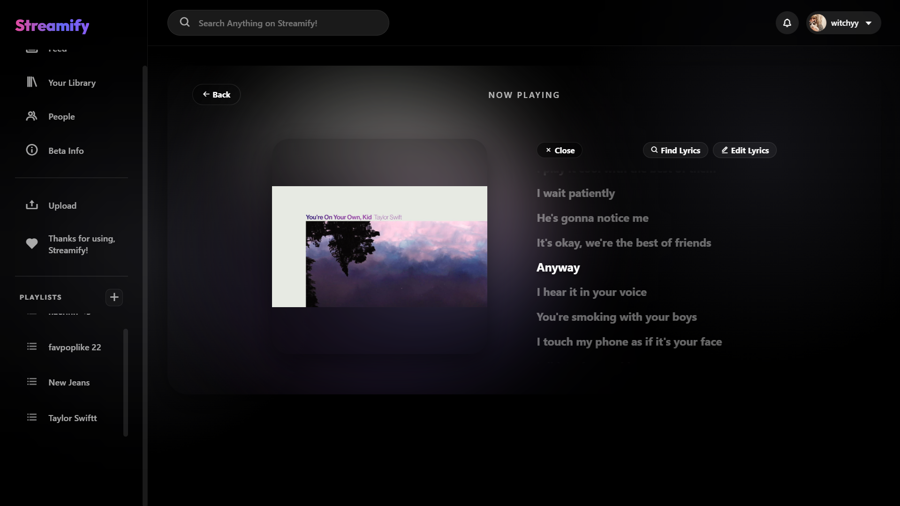
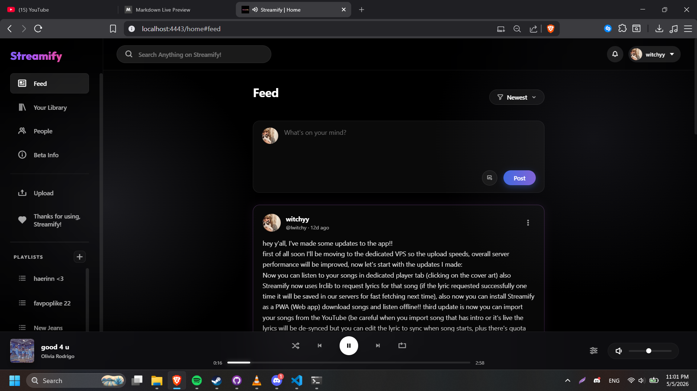
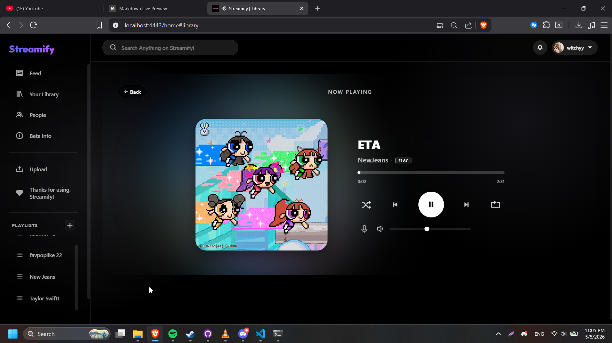
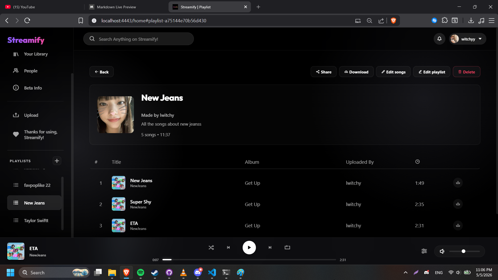

# Streamify



Streamify is your own self-hosted music streaming app built with Node.js. Think of it like your personal streaming platform, but you actually own your files and data. No subscriptions, just pure music.

## Features

*   **User Authentication**: Secure logins and sessions so nobody hijacks your account.
*   **Music Library**: Upload your tracks, organize them, and build your collection.
*   **Playlists**: Curate your own custom playlists and share them with friends.
*   **FLAC Streaming**: High quality lossless audio support for the audiophiles out there.
*   **Soulseek Integration**: Pull tracks directly from the P2P network using slsk-client.
*   **Lyrics Support**: Fetch and sync lyrics seamlessly using the LRCLIB API.
*   **User Profiles & Privacy**: Custom avatars, banners, and privacy settings to control whether your uploaded songs and playlists are public or private.
*   **Basic Telemetry**: We track your listening habits locally to generate stats on your favorite tracks. This data is private and can be exported anytime.
*   **Responsive UI**: Works flawlessly on your phone. It is a PWA, meaning you can install it straight to your home screen.
*   **Live Socials**: Real-time chat and features powered by Socket.io.

## Tech Stack

*   **Backend**: Node.js, Express, Socket.io
*   **Database**: SQLite
*   **Media Processing**: FFmpeg, node-id3, fluent-ffmpeg
*   **Frontend**: Vanilla JS, CSS, HTML

## Requirements

*   Node.js (v18+)
*   FFmpeg installed on your system
*   SSL certificates if you are putting this on the public internet

## Installation

1. Clone the repo
```bash
git clone https://github.com/yourusername/Streamify.git
cd Streamify
```

2. Install the packages inside the Server folder
```bash
cd Server
npm install
```

3. Start the server
```bash
node server.js
```
The server starts on `http://localhost:4443` or whatever port you configure.

## Project Structure

```
Streamify/
├── Server/                 # The Node.js backend
│   ├── server.js           # Main entry point
│   ├── auth.js             # Handles the login flow
│   ├── database.js         # SQLite wrappers
│   ├── media.js            # Audio processing
│   └── package.json        # Dependencies
├── Static/                 # Frontend files (HTML/CSS/JS)
├── MusicLibrary/           # Where your uploaded tracks live
└── Database/               # SQLite files and backups
```

## Security

We built some decent security in here. It has rate limiting to stop brute force attacks, secure cookies, and password hashing. But seriously, do not run this in a massive production environment without putting it behind a proper reverse proxy like Nginx or Cloudflare.

## Troubleshooting

*   **Port in use**: Just change the port in `Server/config.json` or your `.env` file.
*   **Missing directories**: The app should create them on the fly, but if things break, manually make the `MusicLibrary` and `Static/uploads` folders.
*   **FFmpeg errors**: Make sure FFmpeg is actually installed on your OS and in your system PATH.

## Contact

Found a bug or want to contribute? Open a GitHub issue.
Telegram: @lwitchy
Discord: @lwitchy

## Acknowledgments

Huge thanks to [EnderMythex](https://github.com/EnderMythex) for helping test the security, finding exploits so they could be fixed!

Thanks to everyone contributing. Have fun streaming.

## Screenshots




